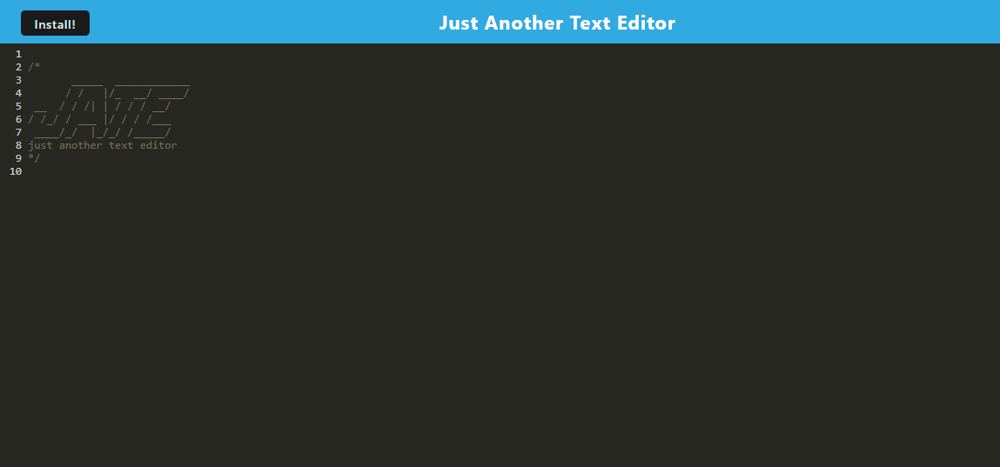

# 19c-PWA-Text-Editor

## Table Of Contents

- [Description](#description)
- [Technologies Used](#technologiesused)
- [Installation](#installation)
- [Usage](#usage)
- [Credits](#credits)
- [License](#license)

## Description

In today's digital age, having a reliable tool for note-taking and text editing is essential. Whether you're a student, a writer, or a programmer, a versatile text editor can significantly enhance your productivity. This project aims to create a powerful, offline-capable text editor that can be accessed from any device. By combining cutting-edge technologies like IndexedDB and PWA, this editor ensures your notes are always accessible, even when you're offline.

This progressive web application provides a robust text editor experience directly in your browser on any device, and can be downloaded to devices as a separate app as well. Whether you're a seasoned developer crafting code or a casual user jotting down notes, this app empowers you to create and manage your notes with ease.

## Technologies Used

-- Node.js
-- Express.js
-- JavaScript
-- IndexedDB API
-- CodeMirror
-- Render for deployment

## Installation

This app simply requires a device with a browser or the ability to install applications. An internet connection is required to download the app, but not to use the app. 

Render Deployment:
https://one9c-pwa-text-editor.onrender.com

GitHub Repository: 
https://github.com/qbres333/19c-PWA-Text-Editor

## Usage

The text editor app can be accessed or downloaded at the following link:
https://one9c-pwa-text-editor.onrender.com

## Credits

Caching Strategies:
https://developer.chrome.com/docs/workbox/caching-strategies-overview/#cache_first_falling_back_to_network

Installing PWAs:
https://developer.mozilla.org/en-US/docs/Web/API/Window/beforeinstallprompt_event
https://developer.mozilla.org/en-US/docs/Web/API/Window/appinstalled_event

workbox-strategies:
https://developer.chrome.com/docs/workbox/modules/workbox-strategies

workbox-recipes (offline-fallback):
https://developer.chrome.com/docs/workbox/modules/workbox-recipes#offline_fallback

html-webpack-plugin Plugin Options:
https://github.com/jantimon/html-webpack-plugin#options

## License

MIT License - see the LICENSE file for details.